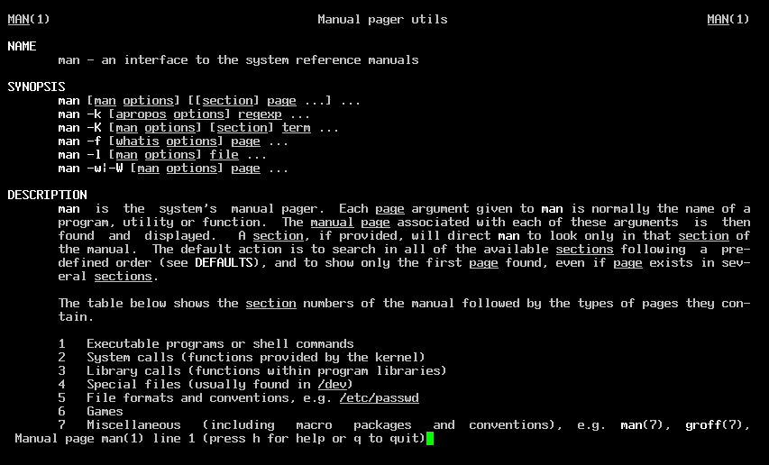
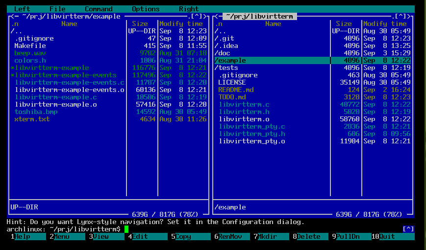
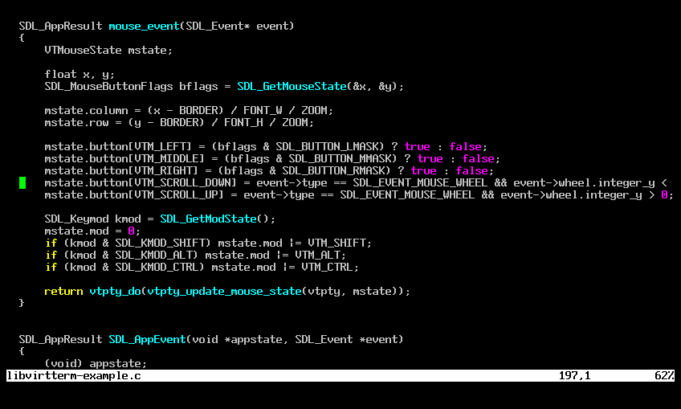
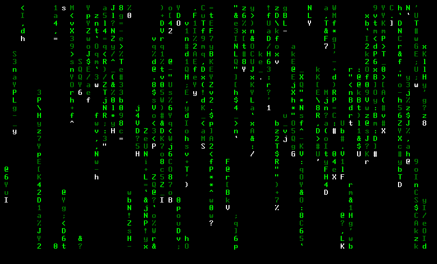

# libvirtterm

`libvirtterm` is a C library for the creation of virtual terminals (terminal emulators). It provides a full terminal
screen matrix that maps input bytes and escape sequences into a 2D grid of styled character cells,
allowing the construction of terminal emulators.

The application should provide the graphical functionalities to transform the 2D grid into something visible to the user.

A small example of an application is included. Here are some screenshots:

*Man page*

*Midnight commander*

*Code edition with vim*

*CMatrix screen saver*

---

# Usage

The best way to use the library is to simply include the files `libvirtterm.h` and `libvirtterm.c` into your sources.
These files will provide only terminal functionality (like a real terminal) - the terminal connectivity is up to the
application.

Another set of files (`libvirtterm_pty.h` and `libvirtterm_pty.c`) will provide the library with the ability to open
and interact with the shell.

The file `example/libvirtterm-example.c` contains an SDL3 application example of how to build an emulator. Reading its
source code, as well as the header `libvirtterm.h` are the best way to understand how to integrate this project.

File `example/libvirtterm-example-events.c` is also provided - it shows how to receive updates from the terminal via
events, instead of redrawing the whole screen every frame. It's useful for slower environments, such as old computers
and microcontrollers.

---

# Functionalities

Already implemented:

- [x] Basic terminal operation
- [x] Parsing of the most popular escape codes
- [x] Full formatting with 16 colors
- [x] Alternate charset (DEC) support
- [x] Mouse support
- [x] Terminal resize (basic)
- [x] Tested with the most popular text applications

Planned:

- [ ] Full xterm escape sequence support
- [ ] Full [vttest](https://invisible-island.net/vttest/) compatibility
- [ ] Unicode support
- [ ] Selection support
- [ ] 256 color / true color support
- [ ] Terminal icons
- [ ] Better terminal resize
